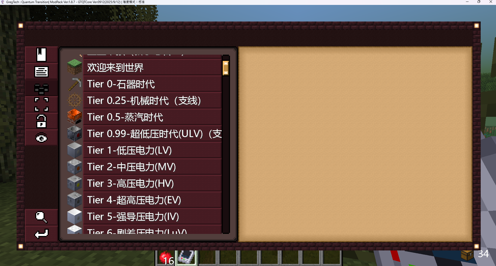
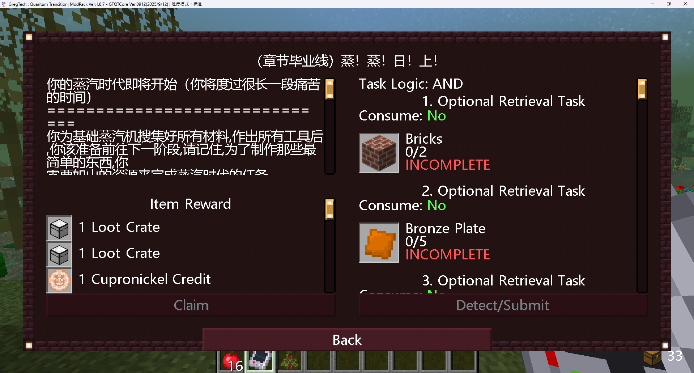
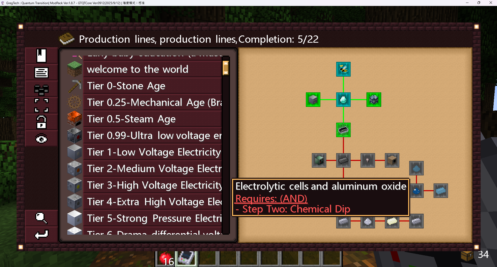
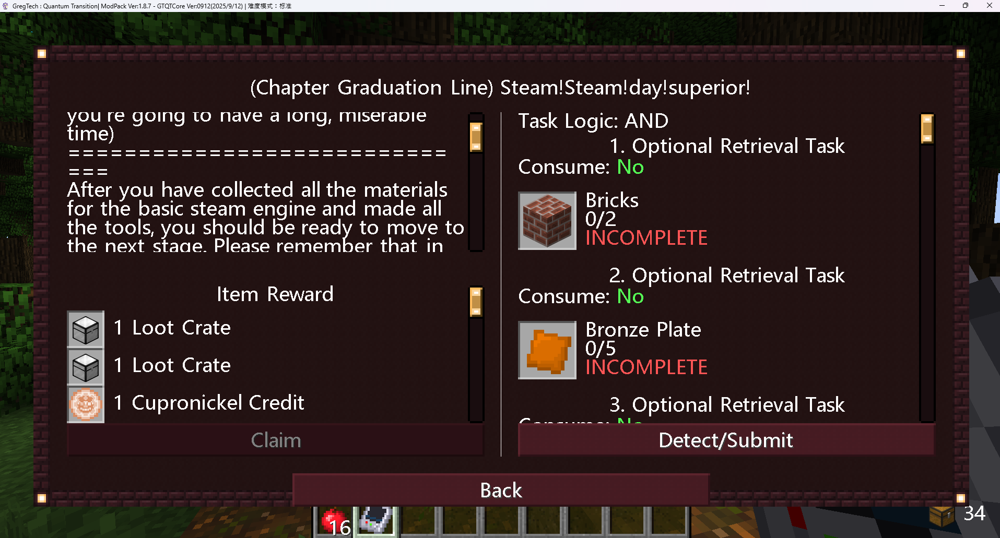

# GregTech Quest Translator

Translates Chinese quest and config text in Minecraft modpack folders to English. Built for GregTech-style packs, but works on any modpack with Chinese text in supported file types.

Supported formats: `.json`, `.toml`, `.cfg`, `.snbt`, `.zs`, `.kubejs`, `.txt`, `.mcfunction`

## Screenshots

### Before translation (Chinese)

| Quest book — chapter overview | Quest book — task details |
|---|---|
|  |  |

### After translation (English)

| Quest book — chapter overview | Quest book — task details |
|---|---|
|  |  |

## Requirements

- **Python 3.10+** ([download](https://www.python.org/downloads/))
- During install on Windows, check **"Add python.exe to PATH"**
- An internet connection (only needed for strings not already in the cache)

> **Windows tip:** use `python -m pip` instead of `pip`. The Python installer does not always add `pip` to PATH as a standalone command.

> **Python 3.13+:** the stdlib `cgi` module was removed. This project installs `legacy-cgi` automatically on those versions because `googletrans` still depends on it indirectly.

## Install

1. Download or clone this repository.
2. Open a terminal in the project folder.
3. Run:

```bash
python -m pip install -e .
```

This installs the `gtqt-translate` command and all dependencies.

## Find your modpack folder

For CurseForge modpacks, the instance folder is usually:

```
C:\Users\<YourName>\curseforge\minecraft\Instances\<Modpack Name>
```

Example:

```
C:\Users\Nojus\curseforge\minecraft\Instances\GregTech Quantum Transition
```

Use the normal path in quotes. You do **not** need the `\\?\` extended path prefix.

## Usage

### 1. Preview first (recommended)

See what would change without modifying any files or calling the translation API:

```bash
gtqt-translate "C:\Users\Nojus\curseforge\minecraft\Instances\GregTech Quantum Transition" --dry-run
```

### 2. Run the translation

When the dry-run output looks right, run it for real. `--backup` saves a `.bak` copy of each file before overwriting:

```bash
gtqt-translate "C:\Users\Nojus\curseforge\minecraft\Instances\GregTech Quantum Transition" --backup
```

Close Minecraft / CurseForge before running if you want to avoid editing files while the game is open.

### 3. Check the summary

When it finishes you will see something like:

```
===== SUMMARY =====
Files processed: 1014
Files modified: 6
New API translations: 608
Strings replaced: 1054
===================
```

- **Files processed** — supported files scanned
- **Files modified** — files that had Chinese text replaced
- **New API translations** — strings translated via Google Translate this run (saved to cache)
- **Strings replaced** — total replacements written into files

## Options

| Flag | Description |
|------|-------------|
| `--dry-run` | Preview changes without writing files or calling the API |
| `--backup` | Create `.bak` copies before overwriting files |
| `--cache PATH` | Use a custom cache file (default: `translation_cache.json` in the project root) |
| `--workers N` | Parallel file workers (default: 4) |
| `-v`, `--verbose` | Print each replacement |
| `--help` | Show all options |

Example with verbose output:

```bash
gtqt-translate "C:\path\to\modpack" --backup -v
```

## Without installing the CLI

If you prefer not to install the command, run it as a module from the project folder:

```bash
python -m gregtech_quest_translator "C:\path\to\modpack" --backup
```

## Translation cache

`translation_cache.json` stores previously translated strings so repeat runs are much faster and use fewer API calls. It is included in the repo so new users benefit from translations already done on large packs like GregTech Quantum Transition.

On each run, any newly translated strings are appended to the cache automatically.

## Troubleshooting

**`pip` is not recognized**

```bash
python -m pip install -e .
```

**`gtqt-translate` is not recognized**

Either reopen your terminal after installing, or use:

```bash
python -m gregtech_quest_translator "C:\path\to\modpack"
```

**Some JSON files are skipped**

A few mod config files may contain invalid JSON unrelated to quests. These are skipped with a message like `Skipping invalid JSON ...` and do not stop the run.

**Translation API errors / rate limits**

Re-run the command later. Already-cached strings will not be re-translated. You can also lower `--workers` and `--batch-size` if needed.

## Development

Generate a small test modpack:

```bash
python scripts/generate_test_data.py
gtqt-translate mock_modpack --dry-run
```

Run tests:

```bash
python -m pip install -r requirements-dev.txt
pytest
```